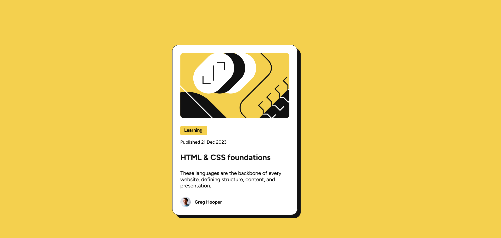

# Frontend Mentor - Blog preview card solution

This is a solution to the [Blog preview card challenge on Frontend Mentor](https://www.frontendmentor.io/challenges/blog-preview-card-ckPaj01IcS). Frontend Mentor challenges help you improve your coding skills by building realistic projects. 

## Table of contents

- [Overview](#overview)
  - [The challenge](#the-challenge)
  - [Screenshot](#screenshot)
  - [Links](#links)
- [My process](#my-process)
  - [Built with](#built-with)
  - [What I learned](#what-i-learned)
  - [Continued development](#continued-development)
- [Author](#author)


## Overview

### The challenge

Users should be able to:

- See hover and focus states for all interactive elements on the page

### Screenshot




### Links
<!-- colocar links -->

- Solution URL: [blog_Challenge](https://github.com/GleberC/blog_challenge)
- Live Site URL: [Blog](https://gleberc.github.io/blog_challenge/)

## My process

### Built with

- Semantic HTML5 markup
- CSS custom properties
- Flexbox
- CSS Grid
- Mobile-first workflow


### What I learned

I tried to use a tags more semantic. And uses styles to a responsive site.

To see how you can add code snippets, see below:

```html
<div class="caixa_texto">
      <span class="box">
        Learning
      </span>
      
      <h2 class="publicacao">
        Published 21 Dec 2023
      </h2>
      <a class="way" href="#">
        HTML & CSS foundations
      </a>

      <p class="texto">
        These languages are the backbone of every website, defining structure, content, and presentation.
      </p>

    </div>
```
```css
 @media (max-width:900px) {
    
        body {
            width: 800px;
          
            display: flex;
            justify-content: center;
            flex-direction: column;
            align-items: center;
        }
    }

@media (max-width:500px) {
  body {
        width: 375px;
        height: 812px;
        display: flex;
        justify-content: center;
        flex-direction: column;
        align-items: center;
}
}
```


### Continued development

I need to continue developing my skills in CSS styling practices to improve the responsiveness and aesthetics of websites. 


## Author

- Frontend Mentor - [@GleberC](https://www.frontendmentor.io/profile/GleberC)
- Github - [@GleberC](https://www.github.com/GleberC)


